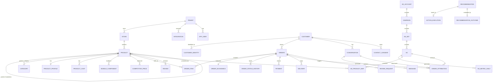

# Kiano Growth OS — 产品需求与技术架构设计 v1.1

| 项目 | 内容 |
|---|---|
| 版本 | v1.1（2026-10-07） |
| 基于 | v1.0 + 对照《KianosMart 增长方案》的评审意见 |
| 项目定位 | 面向 KianosMart 的增长操作系统（利润驱动的数据 + 自动化层） |
| 第一阶段业务 | Ghana / Morgan Electronics / WooCommerce |
| 长期方向 | 可演化为 Ghana / Africa 多商户 E-commerce Growth SaaS |

---

## 0. v1.0 → v1.1 变更摘要

| # | 变更 | 原因 |
|---|---|---|
| 1 | 新增 **Phase 0（零开发）**，路线图与增长方案 90 天计划对齐；追踪采集提前到 Sprint 1 | v1.0 的 8 个 Sprint 交付时 90 天窗口已过；归因数据无法补录 |
| 2 | **WooCommerce 是唯一交易主系统**：Kiano 不再自建订单、不再发起 Paystack 收款；订单状态机改用 Woo 自定义状态实现 | v1.0 §3 与 §20/§22/§50/§54 自相矛盾；Paystack 每个模式只有一个 webhook URL，已被 Woo 插件占用 |
| 3 | 新增 **Click-to-WhatsApp（CTWA）归因**（WhatsApp `referral` 字段） | 增长方案 30% 预算投 CTWA，v1.0 无法归因 WhatsApp 订单 |
| 4 | 新增 **转化信号回传模块**（Meta CAPI、WhatsApp/COD 离线转化、受众同步） | v1.0 只拉报表不回传信号，影响广告优化 |
| 5 | 重写 **指标口径**：CM1/CM2/CM3、Max CAC、CPA vs 新客 CAC、MER、POAS | v1.0 利润口径前后不一，`maximum_cac` 既是输入又是计算值 |
| 6 | 新增 **广告费分摊规则** 与 **广告命名规范** | v1.0 未定义广告费如何落到 SKU / 订单 |
| 7 | 新增 **客户身份合并**（E.164 手机号），客户从订单构建 | Woo 访客订单 `customer_id=0`，`/customers` 接口拿不到 |
| 8 | 同步可靠性：Woo 增量对账、Meta 指标回刷、汇率表 | Woo webhook 会被自动停用；Meta 数据会回溯修正；广告账户可能以 USD 计费 |
| 9 | 新增模块：Reviews & UGC 引擎、COD 配送记录、竞品价格表；Phase 2：Affiliate 台账、素材资产库 | 增长方案的信任飞轮、COD、Bundle、Price Index、代理网络在 v1.0 中缺失 |
| 10 | Growth Advisor 改为 **规则 + 最小样本 + 学习期保护 + 效果追踪**，LLM 只负责解释；取消 LLM 自报置信度 | 日单量 1–3 单时 v1.0 的建议是噪音；无法证明系统价值 |
| 11 | 精简技术栈：去掉 RabbitMQ/Quartz/ClickHouse/多 Agent 编排/Workspace+RBAC；独立 VPS 部署 | 运维面与业务规模不匹配；当前生产为共享 VPS |
| 12 | 新增 **合规章节**（Ghana Data Protection Act 2012, Act 843）与 WhatsApp 24 小时窗口 / 模板 / opt-in 规则 | v1.0 未涉及 |
| 13 | 数据模型修正：`order` → `orders`、商品变体、Bundle、全表 `tenant_id`、补齐缺失表 | 见 §11 |
| 14 | MVP 验收标准改为可度量的数据正确性指标 | v1.0 验收只验证"能同步"，不验证"算得对" |

---

## 1. 产品愿景

Kiano Growth OS 不是 ERP，也不是单纯的数据 Dashboard。它的任务是把：

**商品 → 内容 → 广告 → 流量 → 网站 / WhatsApp → 订单 → 支付 / COD → 配送 → 评价 → CRM → 复购 → 利润**

串成一个闭环，并且**把结果回传给广告平台**，让广告越投越准。

系统每天回答三个问题：

1. 哪些商品在赚钱（广告前、广告后）？
2. 哪些广告 / 渠道在赚钱，数据量是否足以下结论？
3. 今天最值得做的 3–5 件事是什么？

核心输出：**Data → Insight → Recommendation → Action → Outcome**（v1.1 新增 Outcome：每条建议执行后都要衡量效果）。

### 1.1 第一阶段的现实约束

增长方案的第一阶段目标是"每天 5–10 个购买意向 → 1–3 个真实订单"，预算约 GH₵170/天。因此：

- 前 1–2 个月，系统的主要价值是**采集正确的数据 + 算对利润 + 跑通 COD/WhatsApp 流程**，而不是"AI 决策"。
- 任何结论都必须显示样本量；样本不足时，系统应明确说"数据不足"，而不是给出建议。
- 系统建设不能挤占增长方案本身的执行（产品页改造、素材、投放）。能用现成工具做的，先用现成工具。

---

## 2. 设计原则

1. **业务先于系统。** Phase 0 用现成插件和表格跑通，只自建现成工具做不到的部分。
2. **WooCommerce 是唯一交易主系统（System of Record）。** 商品、订单、支付状态、库存、优惠券的写入一律经 Commerce Port 写回 Woo；Kiano 保存镜像 + 增长数据。
3. **先采集，后分析。** 追踪采集最先上线，因为归因数据无法补录。
4. **数据双向流动。** 既从平台拉数据，也把真实转化（确认、签收、WhatsApp 成交）回传给平台。
5. **小样本诚实。** 所有指标带样本量；低于阈值不出结论；不使用 LLM 自报的"置信度"。
6. **规则控风险，AI 做解释和对话。** 决策由可审计的规则产生，LLM 负责把数据讲清楚、在 WhatsApp 里服务客户。
7. **所有写操作可审计、可幂等、可重放。**
8. **合规内建。** 个人数据最小化、营销需 opt-in、可删除。

---

## 3. 路线图（与增长方案 90 天计划对齐）

| 阶段 | 时间 | 对应增长方案 | 交付 |
|---|---|---|---|
| **Phase 0** 零开发 | 第 1–2 周 | W1 修网站、W2 数据基础设施 | 官方插件 + 表格 + 规范，见附录 A |
| **Phase 1** MVP | 第 3–10 周 | W3 素材、W4 开始投放、第 2 个月淘汰低效 SKU | Sprint 1–6，见 §17 |
| **Phase 2** 增长自动化 | 第 3–4 个月 | 第 3 个月扩张：Influencer、WhatsApp agents、Affiliate | AI WhatsApp 销售、跟进序列、UGC 素材库、Affiliate 台账、Google 接入 |
| **Phase 3** 自动化决策 | 有足够数据后 | — | 低风险动作自动执行、holdout 实验 |
| **Phase 4** SaaS 化 | KianosMart 验证后 | — | 多租户产品化 |

**硬依赖：** Sprint 1 的追踪采集插件必须在增长方案第 4 周开始投放之前上线。

---

## 4. 总体架构

```
                         ┌──────────────── 广告平台 ────────────────┐
                         │  Meta Ads / CTWA     Google Ads / MC     │
                         └──────▲───────────────────┬───────────────┘
                     信号回传(CAPI)│                 │报表拉取(Insights/GAQL)
                                  │                 ▼
 ┌──────────── 店铺侧 (VPS: KianosMart) ───────────┐   ┌──────── Kiano Core (独立 VPS) ────────┐
 │ WordPress + WooCommerce  (交易主系统)            │   │  Modular Monolith (Spring Boot)       │
 │  ├ Paystack 插件 (收款 + webhook，唯一)          │   │   ├ commerce-sync   ├ attribution     │
 │  ├ Meta 官方插件 (Pixel + CAPI + Catalog)        │──▶│   ├ customer        ├ signals-out     │
 │  ├ Google for WooCommerce (Merchant feed)        │   │   ├ profit          ├ whatsapp        │
 │  ├ Woo Order Attribution (内置)                  │◀──│   ├ ads             ├ cod-ops         │
 │  └ kiano-connector 自定义插件                    │   │   ├ reviews         ├ advisor         │
 │     (click id 采集 / 自定义订单状态 / GPS 地址)   │   │   └ integration (Commerce Port 等)    │
 └──────────────────────────────────────────────────┘   │  PostgreSQL (OLTP + 分析 + 队列表)      │
          webhook ▶ Kiano ； Kiano ▶ Woo REST 写回        └───────────────▲──────────────────────┘
                                                                        │ webhook / Cloud API
                                                        ┌───────────────┴──────────┐
                                                        │ WhatsApp Business Platform│
                                                        └──────────────────────────┘
```

要点：

- 页面级行为数据（浏览、加购、发起结账）交给 **GA4 + Meta Pixel**，Kiano MVP 不自建埋点管道；Phase 2 再通过 GA4 Data API 拉漏斗聚合数据。
- Kiano 只需要**订单级**归因：由 Woo Order Attribution + kiano-connector 写入订单 meta，随订单同步到 Kiano。
- 队列、发件箱、webhook 收件箱全部用 PostgreSQL 表实现（`SELECT … FOR UPDATE SKIP LOCKED`），MVP 不引入消息中间件。

---

## 5. 系统边界与主数据归属

| 数据 | 主系统 | Kiano 的角色 | 写入方式 |
|---|---|---|---|
| 商品、变体、价格、库存 | WooCommerce | 镜像 + Product Profile（Hero 标记、Product DNA） | 价格/文案修改经审批后通过 Commerce Port 写回 Woo |
| 订单、订单状态 | WooCommerce | 镜像 + 订单经济（成本、CM）+ 状态历史 | 状态变更经 Commerce Port 写回 Woo 自定义状态 |
| 支付 | WooCommerce + Paystack 插件 | **只读**镜像 + 对账 | 不发起收款；不占用 Paystack webhook |
| 优惠券 | WooCommerce | 引用（Affiliate 码、评价激励券） | 通过 Commerce Port 创建 |
| 商品评价 | WooCommerce | 收集、审核后写回 | `POST /wc/v3/products/reviews` |
| 客户身份 | **Kiano** | 从订单 + WhatsApp 构建并合并 | — |
| 成本、利润参数 | **Kiano** | 主数据 | — |
| WhatsApp 对话、同意记录 | **Kiano** | 主数据 | — |
| 配送记录 | **Kiano** | 主数据（MVP 手工录入 / 快递商导入） | — |
| 广告结构与指标 | 广告平台 | 镜像 | Phase 1 只读；预算/暂停操作经审批执行 |

### 5.1 写回 Woo 的防回环规则

Kiano 写 Woo → Woo 触发 `order.updated` webhook → 回到 Kiano。处理方式：

1. 每次写回记录到 `outbound_signal`，并保存 Woo 返回的 `date_modified_gmt`。
2. 收到 webhook 时，若 `(order_id, date_modified_gmt)` 与 Kiano 最近一次写回结果一致，标记为自身发起，仅更新镜像，不触发业务事件。
3. 订单 meta 写入 `_kiano_last_write`（时间戳 + 操作 ID）作为辅助判断。

---

## 6. 模块划分

| 模块 | 阶段 | 说明 |
|---|---|---|
| M01 Tenant & Access | P1 | 只保留 `tenant` + `store` + 用户三种角色（OWNER / OPERATOR / VIEWER）；集成凭证加密存储 |
| M02 kiano-connector（WP 插件） | P1 | 店铺侧采集与自定义状态，见 §7 |
| M03 Commerce Sync | P1 | 商品/变体/分类/订单同步，webhook + 增量对账 |
| M04 Customer Identity | P1 | E.164 手机号合并身份 |
| M05 Cost & Profit | P1 | 成本输入、CM1/2/3、Max CAC、广告分摊，见 §8–9 |
| M06 Ads Analytics | P1（Meta）/ P2（Google） | 指标同步、回刷、汇率、商品映射 |
| M07 Attribution | P1 | 网站 + CTWA + 优惠码 + 手工来源，见 §10 |
| M08 Signals Out | P1 | Meta CAPI 自定义事件 / WhatsApp 成交回传；P2 受众同步、Google 离线转化 |
| M09 WhatsApp CRM | P1 | Cloud API 收件箱、CTWA referral、模板、opt-in、人工处理 |
| M10 Order & COD Ops | P1 | 状态机、确认流程、风险规则、配送记录 |
| M11 Reviews & UGC | P1（评价）/ P2（UGC 素材） | 信任飞轮 |
| M12 Growth Advisor | P1（规则版） | 规则 + 最小样本 + 效果追踪 + LLM 解释 |
| M13 Competitor Price Index | P1（手工录入） | 每周 Hero SKU 比价 |
| M14 WhatsApp AI Sales Agent | P2 | 单一 Agent + 工具层 |
| M15 Content Asset Library | P2 | 素材、角度、授权、表现 |
| M16 Affiliate Ledger | P2 | 代理 = 优惠码；佣金台账 |
| M17 AI Content Factory | P2 | Product DNA → 文案/脚本草稿，人工审核 |

---

## 7. M02 kiano-connector（WordPress 自定义插件）

位置：KianosMart 仓库 `wp-content/plugins/kiano-connector/`，按仓库规则在 `docker-compose.yml` 的 `wordpress` 服务下增加 bind mount；如含前端 JS，`nginx` 服务同样以只读方式挂载。

### 7.1 采集

- 前端 JS 生成 `kiano_vid`（访客 ID，first-party cookie，365 天）和 `kiano_sid`（会话 ID，30 分钟无活动过期）。必须在前端生成，因为 Cloudflare / 页面缓存会让服务端生成失效。
- 首次落地时记录 `fbclid`、`gclid`、`_fbc`、`_fbp`、`utm_*`、landing URL、时间（first touch 与 last touch 各一份，cookie 存储，7 天）。
- 下单时写入订单 meta：`_kiano_vid`、`_kiano_sid`、`_kiano_first_touch`、`_kiano_last_touch`（JSON）。
- 与 WooCommerce 内置 Order Attribution（`_wc_order_attribution_*`）并存：内置字段提供 source type / utm，插件补充 click id 和访客 ID。

### 7.2 结账字段

- 增加 **GhanaPost GPS 数字地址**（可选填，COD 订单强烈提示填写）。
- 电话字段前端校验并提示 Ghana 号码格式。

### 7.3 自定义订单状态

| 状态 slug | 含义 |
|---|---|
| `wc-kiano-awaiting` | 待确认（COD / WhatsApp 订单） |
| `wc-kiano-confirmed` | 已确认，待发货 |
| `wc-kiano-dispatched` | 已发货 |
| `wc-kiano-refused` | 拒收 / 配送失败 |

实现注意：

- COD 订单通过 `woocommerce_cod_process_payment_order_status` 过滤器直接进入 `wc-kiano-awaiting`。
- 自定义状态需显式处理：库存扣减（进入 awaiting 时扣减，进入 refused / cancelled 时回补）、邮件通知、纳入 Woo Analytics 统计的状态列表。
- 必须兼容 HPOS。

---

## 8. 指标口径（v1.1 统一定义）

所有金额以店铺币种 GHS 计。

| 指标 | 定义 |
|---|---|
| 净收入 Net Revenue | 商品小计 − 折扣 + 向客户收取的配送费 |
| **CM1** | 净收入 − 商品成本 − 支付手续费 |
| **CM2（广告前贡献利润）** | CM1 − 实际配送成本 − 包装成本 − COD 失败成本 − 退货/售后成本 |
| **CM3（广告后贡献利润）** | CM2 − 分摊广告费 − WhatsApp 付费消息成本 − 佣金（Affiliate / Influencer） |
| Max CAC（SKU 级，计划值） | 预期单位 CM2 − 目标单位利润；**只计算，不存储** |
| CPA | 某渠道 / Campaign 广告费 ÷ 该渠道归因订单数 |
| 新客 CAC | 获客类广告费（不含再营销）÷ 新客户数 |
| MER | 全部广告费 ÷ 全部净收入（不依赖归因的总体效率） |
| 平台 ROAS | 广告平台报告的转化价值 ÷ 花费（仅参考） |
| Kiano ROAS | Kiano 归因净收入 ÷ 花费 |
| **POAS** | Kiano 归因 CM2 ÷ 花费；> 1 表示广告赚钱。这就是"ROAS 5.2 但实际亏损"的判定指标 |
| AOV | 净收入 ÷ 订单数 |
| COD 拒收率 | 拒收/失败 COD 订单数 ÷ 已发货 COD 订单数 |
| 归因覆盖率 | 有渠道归因的订单数 ÷ 总订单数 |

补充规则：

- **两种收入口径并存**：下单口径（看需求）与签收口径（看利润）。COD 订单的利润一律按签收口径计算。
- **预期值 vs 实际值**：SKU 级 Max CAC 用预期值（成本参数 × 历史比率）；订单级 CM 用实际值（实际运费、实际是否拒收）。
- **默认时间窗**：Dashboard 默认显示 7 日滚动，同时提供昨日和 30 日；不默认显示"今天"。

### 8.1 成本参数

- SKU 级：单位成本、包装成本、预估配送成本（按配送区域）、生效期。
- 店铺级：各支付渠道手续费率、单次 COD 失败成本（往返运费 + 包装损耗）、默认退货率、目标单位利润或目标利润率。
- 比率类参数（COD 拒收率、退货率）在有足够数据后由系统从实际数据计算，人工可覆盖。
- Bundle：成本 = 各组件成本 × 数量之和；订单行按组件展开计算商品成本。

---

## 9. 广告费分摊规则

v1.0 在订单上存 `marketing_cost`；v1.1 改为**在期间 + 维度层面计算**，不写入单个订单。

1. **广告 → SKU 映射**（`ad_product_map`）：优先由广告命名规范自动解析（附录 B），其次人工指定。
2. **单 SKU 广告**：花费全部计入该 SKU。
3. **多 SKU 广告（目录广告、Bundle 广告）**：按该广告归因订单中各 SKU 的净收入占比分摊；无归因订单时按映射权重（默认均分）。
4. **无法映射的花费**（再营销、品牌、互动类）：保留在渠道 / Campaign 层，显示为"未分摊广告费"；店铺整体 CM3 和 MER 包含全部花费。
5. **SKU 级 POAS** 只使用已映射花费，并同时显示"未分摊占比"，提醒结论的不确定性。

---

## 10. 追踪与归因

### 10.1 触点来源

| 来源 | 识别方式 | 关键字段 |
|---|---|---|
| 网站（广告 / 自然） | Woo Order Attribution + kiano-connector 订单 meta | `utm_*`、`fbclid`、`gclid`、`utm_content={{ad.id}}` |
| Click-to-WhatsApp | WhatsApp 入站消息 webhook 的 `referral` 对象 | `source_id`（广告 ID）、`source_type`、`ctwa_clid`、`source_url` |
| Affiliate / Influencer | 订单使用的优惠码 | 优惠码 → affiliate |
| 电话 / 线下 / 其他 | 运营人员手工选择 | `origin = PHONE/OTHER` + 渠道 |

### 10.2 订单与 WhatsApp 对话的关联

- 通过 Kiano 在 WhatsApp 中创建的订单：订单 meta 写入 `_kiano_conversation_id`。
- 网站订单：若下单手机号在下单前 7 天内有 WhatsApp 对话，自动关联。

### 10.3 主归因（Phase 1：Last Touch）

每个订单记录所有触点，并按以下优先级选出一个主归因：

1. 订单关联的 WhatsApp 对话带 CTWA referral，且在下单前 7 天内 → 该 CTWA 广告
2. 网站最后一次非直接访问触点（7 天内）→ 对应广告 / 渠道
3. 使用 Affiliate 优惠码 → Affiliate 渠道（佣金照常计算，不受主归因影响）
4. 其他 → Direct / Organic / Unknown

First Touch、Linear 等模型推迟到 Phase 3。数据量不足时，复杂归因模型没有意义。

---

## 11. 数据模型

约定：所有表包含 `tenant_id`；时间统一存 UTC；金额字段带 `currency` 或明确为 GHS；外部 ID 唯一约束为 `(tenant_id, external_id)`。

### 11.1 ER 概览（Phase 1）



### 11.2 核心表

**组织与集成**

```
tenant            id, name, slug, currency, timezone, status, created_at
store             id, tenant_id, platform, base_url, status
app_user          id, tenant_id, email, name, role(OWNER|OPERATOR|VIEWER), status
integration       id, tenant_id, provider, account_ref, credentials_encrypted,
                  scopes, api_version, status, last_sync_at
```

**商品**

```
product           id, tenant_id, store_id, external_id, parent_external_id,
                  type(simple|variable|variation|bundle), sku, brand, name, slug,
                  regular_price, sale_price, stock_qty, stock_status, status,
                  permalink, image_url, woo_modified_at, synced_at
category          id, tenant_id, external_id, parent_id, name
product_category  product_id, category_id
product_profile   product_id, sku_role(HERO|PROFIT|BUNDLE|LONG_TAIL|SLOW_MOVER),
                  role_source(MANUAL|AUTO), product_dna_json, updated_at
product_cost      id, tenant_id, product_id, unit_cost, packaging_cost,
                  est_delivery_cost_json(按区域), effective_from, effective_to, note
bundle_component  bundle_product_id, component_product_id, qty
cost_assumption   id, tenant_id, key, value, effective_from, effective_to
                  -- 支付费率(按渠道)、COD 失败成本、默认退货率、目标单位利润等
competitor_price  id, tenant_id, product_id, competitor, url, price, in_stock,
                  observed_at, observed_by
```

**客户**

```
customer          id, tenant_id, primary_phone_e164, name, email, city, region,
                  first_order_at, last_order_at, orders_count, delivered_count,
                  refused_count, net_revenue_total, cm2_total, tags[], created_at, updated_at
customer_identity id, tenant_id, customer_id, type(PHONE|WHATSAPP|EMAIL|WOO_CUSTOMER_ID),
                  value_normalized, source, created_at
                  UNIQUE(tenant_id, type, value_normalized)
contact_consent   id, tenant_id, customer_id, channel(WHATSAPP|SMS|EMAIL),
                  purpose(MARKETING), status, source, captured_at, revoked_at
```

身份合并规则：手机号统一规范为 E.164（`0244123456`、`233244123456`、`+233 24 412 3456` → `+233244123456`）；同一 E.164 号码即同一客户；邮箱作为辅助匹配，冲突时人工合并。

**订单**

```
orders            id, tenant_id, store_id, external_id, customer_id,
                  origin(WEB|WHATSAPP|PHONE|OTHER), status(Woo 镜像), payment_method,
                  is_cod, currency, subtotal, discount, shipping_charged, total,
                  coupon_codes[], ghanapost_gps, cod_risk_level,
                  placed_at, confirmed_at, dispatched_at, delivered_at, closed_reason,
                  woo_modified_at, synced_at
order_item        id, tenant_id, order_id, product_id, sku, qty, unit_price,
                  discount, unit_cost_snapshot, line_net_revenue
order_economics   order_id, tenant_id, net_revenue, product_cost, payment_fee,
                  delivery_cost_actual, packaging_cost, failure_cost, return_cost,
                  cm1, cm2, basis(PLACED|DELIVERED), computed_at
order_status_history id, tenant_id, order_id, from_status, to_status,
                  changed_by(KIANO|WOO|USER), actor_id, changed_at
payment           id, tenant_id, order_id, provider, reference, channel, amount,
                  currency, status, paid_at, source(WOO_META|PAYSTACK_API)
                  UNIQUE(tenant_id, provider, reference)
delivery          id, tenant_id, order_id, courier, tracking_ref, zone, status,
                  cost_actual, attempts, failure_reason, dispatched_at, delivered_at
```

**归因与广告**

```
order_attribution id, tenant_id, order_id, touch_type(WEB|CTWA|COUPON|MANUAL),
                  is_primary, channel, platform, campaign_external_id, ad_external_id,
                  utm_source, utm_medium, utm_campaign, utm_content, utm_term,
                  fbclid, gclid, ctwa_clid, conversation_id, affiliate_code, touch_at
ad_account        id, tenant_id, platform, external_id, name, currency, timezone
campaign          id, tenant_id, ad_account_id, external_id, name, objective,
                  status, daily_budget, budget_currency
ad_set            id, tenant_id, campaign_id, external_id, name, status, daily_budget
ad                id, tenant_id, ad_set_id, external_id, name, status, creative_asset_id
ad_metric_daily   id, tenant_id, ad_id, date(广告账户时区), impressions, reach, clicks,
                  outbound_clicks, spend, currency, spend_ghs, messaging_conversations_started,
                  platform_purchases, platform_purchase_value, actions_json, fetched_at
                  UNIQUE(tenant_id, ad_id, date)
fx_rate           date, base, quote, rate, source   PK(date, base, quote)
ad_product_map    id, tenant_id, ad_id, product_id, source(NAMING|MANUAL), weight
```

**WhatsApp**

```
conversation      id, tenant_id, customer_id, wa_phone_e164, status(OPEN|PENDING|CLOSED),
                  assigned_to, ai_enabled, last_inbound_at, window_expires_at,
                  referral_source_type, referral_source_id, referral_source_url,
                  ctwa_clid, referral_at, intent, summary, handoff_reason
message           id, tenant_id, conversation_id, direction(IN|OUT), type, body,
                  media_ref, provider_message_id, template_name, pricing_category,
                  cost, status, sent_by(AI|USER|SYSTEM), created_at
                  UNIQUE(tenant_id, provider_message_id)
wa_template       id, tenant_id, name, language, category(MARKETING|UTILITY|AUTHENTICATION),
                  status, body, variables_json
```

**评价**

```
review_request    id, tenant_id, order_id, channel, sent_at, status,
                  responded_at, incentive_coupon_code
review            id, tenant_id, product_id, order_id, customer_id, rating, text,
                  media_refs[], ugc_consent, status(PENDING|APPROVED|PUBLISHED|REJECTED),
                  woo_review_id, created_at
```

**决策、执行与审计**

```
recommendation    id, tenant_id, rule_code, title, narrative, target_type, target_id,
                  evidence_json(指标快照 + 样本量 + 时间窗), proposed_action_json,
                  risk_level, status(OPEN|APPROVED|REJECTED|EXECUTED|EXPIRED),
                  created_at, expires_at
action_execution  id, tenant_id, recommendation_id(可空), action_type, target_type,
                  target_id, payload, risk_level, requested_by(RULE|AI|USER),
                  approved_by, approved_at, executed_at, result, before_json, after_json
recommendation_outcome id, recommendation_id, baseline_json, eval_7d_json,
                  eval_14d_json, verdict(IMPROVED|NO_CHANGE|WORSE|INCONCLUSIVE)
audit_log         id, tenant_id, actor_type(USER|AI|RULE|SYSTEM), actor_id, action,
                  target_type, target_id, before_json, after_json, reason, source, created_at
```

v1.0 中 `recommendation → approval` 与 `ai_action.status` 两条审批路径合并为 `action_execution` 一条。

**基础设施表**

```
inbound_event     id, tenant_id, provider, idempotency_key, topic, payload, headers,
                  received_at, status, attempts, processed_at, error
                  UNIQUE(tenant_id, provider, idempotency_key)
outbound_signal   id, tenant_id, target(WOO|META_CAPI|WHATSAPP|GOOGLE), dedupe_key,
                  payload, status, attempts, next_attempt_at, sent_at, response
                  UNIQUE(tenant_id, target, dedupe_key)
sync_cursor       tenant_id, provider, resource, cursor_value, updated_at
```

**Phase 2 新增**：`creative_asset`（商品、hook 角度、真实/AI 标记、授权、文件引用）、`affiliate`、`affiliate_commission`、`ai_run`、`knowledge_doc`（pgvector）、`content_draft`。

---

## 12. 集成设计

### 12.1 WooCommerce（Commerce Port → WooCommerceAdapter）

- 读：`/wp-json/wc/v3/products`（含 variations）、`/orders`、`/products/categories`、`/coupons`。
- **客户从订单构建**：访客订单 `customer_id=0`，`/customers` 接口只用于补充注册用户信息。
- Webhook：`order.created`、`order.updated`、`product.updated`、`product.created`。校验 `X-WC-Webhook-Signature`（HMAC-SHA256，base64）。
- **幂等键**：`{resource}:{id}:{date_modified_gmt}`。Woo 没有稳定的事件 ID，不能依赖 delivery ID。
- **增量对账**：Woo webhook 连续投递失败后会被自动停用，因此每 15 分钟按 `modified_after` 拉取一次，每日全量校验一次订单数和金额。
- 写回：订单状态、订单备注、WhatsApp 订单创建、优惠券、评价、（审批后）商品文案和价格。
- Cloudflare：为 `/wp-json/wc/` 配置 WAF 放行规则（限定 Kiano 服务器 IP），避免 API 调用被质询拦截。

### 12.2 Paystack（只读）

- **不修改 Paystack 后台的 webhook URL。** 每个模式只能配置一个，必须继续指向 Woo Paystack 插件，否则网站上异步确认的 MoMo 订单会停在 pending。
- Kiano 从 Woo 订单读取支付方式和状态；每日调用 Paystack 交易查询接口对账（Woo 订单状态 vs Paystack 实际状态），差异生成告警。
- WhatsApp 订单需要预付时：先在 Woo 创建订单（`pending`），把 Woo 的订单付款链接发给客户，由 Paystack 插件完成收款。
- 幂等原则：一个 Woo 订单对应一个或多个支付尝试；一个 Paystack reference 只能对应一个订单（`UNIQUE(provider, reference)`）。

### 12.3 Meta Marketing API（读）

- 同步 ad account / campaign / ad set / ad 结构和 `insights`（level=ad，按天）。
- **回刷**：每次同步覆盖最近 7 天，每周一次覆盖最近 28 天，按 `(ad_id, date)` upsert。平台指标会在归因窗口内回溯修正。
- 记录广告账户的 `currency` 和 `timezone`；花费按当日汇率换算为 `spend_ghs`。
- 同步频率：每 2–4 小时（Phase 1）。

### 12.4 Meta 转化回传（M08）

- 网站 Pixel + CAPI 由官方插件负责（Phase 0），保留其标准 `Purchase` 事件，避免重复上报。
- Kiano 通过 CAPI 补充自定义事件：`OrderConfirmed`、`OrderDelivered`、`OrderRefused`，`event_id = order_{id}_{event}`。数据足够后，评估是否把广告优化目标改为签收类事件。
- WhatsApp 订单没有网页事件：使用 Conversions API for Business Messaging 回传 `Purchase`（需 `ctwa_clid`）。
- Phase 2：客户分群同步到 Custom Audiences（手机号 SHA-256 哈希，仅限有 opt-in 的客户）；Google 离线转化导入（gclid）。

### 12.5 WhatsApp Business Platform（Cloud API）

- 号码方案：现有号码 +233 54 660 3878 是迁移到 Cloud API，还是使用 Business App 与 Cloud API 共存，需要先确认 Ghana 是否支持共存（见附录 C）。
- 需要完成 Meta Business 认证、显示名称审核、模板审核。
- 入站 webhook：消息、状态回执；首条消息若带 `referral`，写入 conversation 的 CTWA 字段。
- 幂等键：消息 `wamid`；状态回执 `wamid:status`。

### 12.6 Google（Phase 2）

- Merchant Center 在 Phase 0 通过 Google for WooCommerce 插件完成。
- Google Ads API 需要 developer token 审核，**现在就申请**；Phase 2 用 GAQL 拉取，并接入 GA4 Data API 获取漏斗聚合。

### 12.7 Webhook 处理统一流程

```
Receive → Authenticate(签名) → Parse → 计算 idempotency_key
→ INSERT inbound_event（冲突即重复，直接返回 200）→ Return 200
→ Worker 异步处理（失败重试，超过次数进入死信状态并告警）
```

不在 webhook HTTP 请求内执行任何长任务或 LLM 调用。

---

## 13. M10 订单与 COD 运营

### 13.1 状态机（全部为 Woo 状态，Kiano 镜像）

```
网站预付:   pending ──(Paystack 成功)──▶ processing ──▶ kiano-dispatched ──▶ completed
网站 COD:   kiano-awaiting ──确认──▶ kiano-confirmed ──▶ kiano-dispatched ──▶ completed
                 │                                            │
                 └──超时未确认──▶ cancelled                    └──拒收/失败──▶ kiano-refused
WhatsApp:   由 Kiano 经 Commerce Port 创建：COD → kiano-awaiting；预付 → pending + 付款链接
```

`completed` 即"已签收"。签收后触发：CM 按签收口径重算、CAPI `OrderDelivered`、评价请求排程。

### 13.2 COD 确认流程

1. 进入 `kiano-awaiting` → 立即发送 WhatsApp **utility 模板**（订单摘要 + 确认按钮）。
2. 按风险等级处理：

| 风险 | 处理 |
|---|---|
| LOW | WhatsApp 确认即可 |
| MEDIUM | WhatsApp 确认 + 电话确认 |
| HIGH | 电话确认 + 要求小额配送押金，或提供 MoMo 预付折扣（增长方案 §22） |

3. 4 小时未回复 → 提醒；24 小时未确认 → 运营决定取消或继续跟进。

### 13.3 COD 风险规则（冷启动版，规则可配置）

| 规则 | 结果 |
|---|---|
| 该客户历史拒收 ≥ 1 次 | HIGH |
| 同一号码 24 小时内多单 | HIGH（人工复核） |
| 新客户且订单金额 > 阈值（初始 GH₵800） | MEDIUM |
| 非 Accra/Tema 且未填 GhanaPost GPS | MEDIUM |
| 老客户且有签收记录 | LOW |

v1.0 中的 "Phone Reputation"、"Distance" 在没有数据源前不使用。积累 3 个月以上的签收/拒收数据后，再评估统计模型。

### 13.4 配送记录

MVP 由运营人员在 Kiano 中录入（或导入快递商报表）：快递商、区域、实际运费、尝试次数、失败原因。COD 拒收率和实际配送成本是利润模型的输入，必须从这里产生。

---

## 14. M09 WhatsApp CRM

### 14.1 平台规则（设计约束）

- **24 小时客服窗口**：客户最后一条消息后 24 小时内可以发送自由消息；超出窗口只能发送已审核的模板消息。
- 模板分 MARKETING / UTILITY / AUTHENTICATION 三类，按条计费，费用以 Meta 当前定价为准。营销模板需要客户 opt-in。
- 所有发出消息记录 `pricing_category` 和 `cost`，计入 CM3。

### 14.2 跟进序列（增长方案 §21）

| 时间点 | 条件 | 方式 |
|---|---|---|
| 询价后 15 分钟 | 窗口内 | 自由消息 |
| 4 小时 | 窗口内 | 自由消息 |
| 次日 | 通常已超出窗口 | 营销模板，**仅限已 opt-in 客户** |
| 之后 | — | 停止，转入再营销受众 |

Phase 1 由运营人员在收件箱中按提示手动发送；Phase 2 自动化。

### 14.3 收件箱功能（Phase 1）

- 统一收件箱、分配、标签、客户历史订单、COD 确认按钮。
- 显示 CTWA 来源广告和对应商品。
- 人工代客下单：选择商品 → 经 Commerce Port 在 Woo 创建订单（自动带 `_kiano_conversation_id`）。
- 支持英语回复模板；Phase 2 的 AI 需要能理解 Pidgin 和 Twi 的常见表达。

### 14.4 客户标签

`NEW`、`REPEAT_BUYER`、`HIGH_VALUE`、`COD`、`PREPAID`、`PRICE_SENSITIVE`、`ABANDONED`、`DORMANT`、`VIP`、`{CATEGORY}_INTEREST`。标签由规则自动生成，可人工增删。

---

## 15. M11 Reviews & UGC 引擎（信任飞轮）

```
签收(completed) → +3 天 WhatsApp utility 模板请求评价
→ 客户回复评分 / 文字 / 照片 / 视频
→ 生成下单优惠券（如 5% off，经 Commerce Port 创建）并发送
→ 运营审核 → 写回 Woo 商品评价（结构化数据随之生效）
→ 勾选了 UGC 授权的照片/视频进入素材库（Phase 2）→ 广告素材
```

规则：

- 绝不伪造评价；激励不以好评为条件。
- 只向已签收订单请求评价，每单最多一次请求 + 一次提醒。
- 指标：评价请求回复率、每个 Hero SKU 的评价数（目标 10 → 20 → 50）。

---

## 16. M12 Growth Advisor（规则版）

### 16.1 架构

```
定时任务（每日 07:00）
  → 规则引擎读取 7 日 / 30 日指标 + 样本量
  → 产生 recommendation（含 evidence_json）
  → LLM 把当日结论写成简报（只解释数据，不改变结论）
  → 运营审批 → action_execution → 7 天 / 14 天后写入 recommendation_outcome
```

### 16.2 最小样本阈值（初始值，可配置）

| 结论类型 | 最低要求 |
|---|---|
| CTR 判断 | ≥ 1,000 次展示 且 ≥ 20 次点击 |
| CPA / POAS 判断 | ≥ 10 个归因订单，或花费 ≥ 3 × 目标 CPA |
| SKU 转化判断 | ≥ 300 个商品页浏览（来自 GA4） |
| COD 拒收率判断 | ≥ 20 个已发货 COD 订单 |

未达阈值时，建议显示为"观察中（样本 n/阈值）"，不生成操作。

### 16.3 规则目录（Phase 1）

| 规则 | 条件 | 建议 | 风险 |
|---|---|---|---|
| R01 广告亏损 | POAS < 0.8 且达到样本 | 暂停或更换素材 | HIGH |
| R02 可放量 | POAS > 1.5，CPA < 0.7 × Max CAC，库存 > 20 | 预算 +20% | HIGH |
| R03 加购高、成交低 | ATC 率高于店铺均值，购买率低于均值 | 检查价格、配送费、结账流程 | LOW（任务） |
| R04 缺货仍在投 | 库存 = 0 且广告投放中 | 暂停相关广告 | MEDIUM |
| R05 低库存高需求 | 库存 < 7 天销量 | 补货提醒 | LOW（任务） |
| R06 COD 拒收高 | 拒收率 > 20% | 提高该区域/SKU 的风险等级 | MEDIUM |
| R07 价格偏离 | Hero SKU 价格高于竞品中位数 5% 以上 | 价格复核或做 Bundle | HIGH |
| R08 评价缺口 | Hero SKU 评价 < 5 | 优先请求评价 | LOW（任务） |

### 16.4 学习期保护

- 同一广告组两次预算调整至少间隔 3 天，单次调整不超过 ±20%。
- Meta 每个广告组每周约需 50 次优化事件才能稳定退出学习期。按当前预算，网站购买类广告很可能长期处于学习期，Advisor 需要在简报中注明，并建议合并广告组或使用更高频的优化事件。

### 16.5 效果追踪

- 执行时记录基线（前 7 天指标）；执行后 7 天、14 天自动评估，写入 verdict。
- 这是前后对比，不是因果证明；重要决策在 Phase 3 使用 holdout（时间段或区域对照）。
- Dashboard 汇总"已执行建议的效果分布"。这是证明 Growth OS 价值的依据（见 §21）。

---

## 17. MVP 范围与 Sprint 计划

Sprint 长度 1–2 周，按开发人力调整；**顺序比时长重要**。

| Sprint | 内容 | 完成后的业务价值 |
|---|---|---|
| **S0**（第 1–2 周，零开发） | 附录 A 全部事项 | 增长方案 W1–W2 的数据基础设施到位 |
| **S1** | kiano-connector 插件（采集、自定义状态、GPS 地址、COD 状态）；Kiano 骨架（认证、tenant、凭证加密、inbound_event、outbound_signal、audit_log） | **投放开始前**采集就已上线 |
| **S2** | Commerce Sync（商品/变体/分类/订单含访客/状态历史）、客户身份合并、增量对账 | 所有订单和客户进入 Kiano |
| **S3** | 成本录入（界面 + CSV 导入）、CM1/2/3、order_economics、Dashboard（7 日滚动） | 第一次看到每个 SKU 的真实利润和 Max CAC |
| **S4** | Meta Ads 同步 + 回刷 + 汇率、命名规范解析、广告费分摊、网站归因、POAS | 回答"哪个广告赚钱" |
| **S5** | WhatsApp 收件箱、CTWA 归因、COD 确认模板与流程、风险规则、配送记录 | WhatsApp 和 COD 进入闭环 |
| **S6** | CAPI 自定义事件 + WhatsApp 成交回传、评价请求与回写、Growth Advisor 规则版 + 效果追踪、竞品价格录入 | 飞轮和每日简报运转 |

**Phase 2（第 3–4 个月）**：WhatsApp AI 销售 Agent、自动跟进序列、UGC 素材库、Affiliate 台账、受众同步、Google Ads / GA4 接入、AI Content Factory。

### 17.1 MVP 不做

- Kiano 侧 Paystack 收款与 webhook
- 多 Agent 编排、Decision Agent
- Workspace 层级、细粒度 RBAC
- RabbitMQ、Quartz 集群、ClickHouse、独立向量数据库
- 自建页面级埋点管道（交给 GA4 / Pixel）
- Dynamic Pricing、ML 预测、复杂归因模型
- 完整 Affiliate 平台、Influencer Marketplace
- TikTok Ads 自动化、自动视频生成、AI 自动建广告
- 仓储 ERP、车队管理、多国税务

---

## 18. Phase 2：AI 设计

### 18.1 原则（沿用 v1.0）

- AI 不直接访问数据库，只通过工具层；AI 不拥有事实，价格、库存、政策都来自工具返回。
- 不做"万能 Agent"。Phase 2 只有一个真正带工具调用的 Agent：**WhatsApp Sales Agent**。Product / Marketing 侧的 AI 是"生成草稿 + 解释数据"，不需要编排框架。

### 18.2 WhatsApp Sales Agent 工具

```
search_products(query)        get_product(id)            check_stock(id)
get_delivery_quote(zone)      get_policy(topic)          get_customer_history(phone)
create_woo_order(items, address, payment=COD|PREPAID)   -- 经 Commerce Port，COD 进入 kiano-awaiting
send_payment_link(order_id)   -- 发送 Woo 订单付款链接
handoff_to_human(reason, summary, intent, recommended_action)
```

- AI 创建的 COD 订单同样走 §13 的确认流程，不跳过。
- 自动转人工的情况：退款、投诉、情绪激烈、保修争议、配送丢失、支付争议、复杂议价、AI 连续两次无法回答。
- 只在 24 小时窗口内自动回复；窗口外由规则决定是否发送模板。

### 18.3 Product DNA 与知识库

- Product DNA（沿用 v1.0 结构）存于 `product_profile.product_dna_json`，供 Sales Agent、Content Factory、SEO 使用；由 AI 生成草稿，人工确认。
- 知识库：结构化事实放 PostgreSQL，语义检索用 pgvector（同库）。来源：商品、保修、配送、退货、支付政策、FAQ、促销规则、话术。

### 18.4 AI Content Factory

输入商品 ID → 输出文案、SEO、Hook、UGC 脚本、分镜、图片提示词 → 进入 `content_draft` → 人工审核 → 发布或交给拍摄。遵循增长方案"70% 真实素材 / 30% AI"，AI 素材必须标记，不得生成虚假的产品功能。

---

## 19. 动作风险分级（统一）

| 动作 | 风险 | Phase 1 | Phase 3 |
|---|---|---|---|
| 生成任务 / 提醒 | LOW | 自动 | 自动 |
| 发送评价请求、COD 确认模板 | LOW | 自动（规则触发） | 自动 |
| 支付失败通知客户 | LOW | 自动 | 自动 |
| 暂停广告（缺货触发） | MEDIUM | 审批 | 可自动 + 事后通知 |
| 调整 COD 风险等级 | MEDIUM | 审批 | 可自动 |
| 调整预算、暂停 Campaign | HIGH | 审批 | 审批（规则限额内可自动） |
| 修改价格 | HIGH | 审批 | 审批 |
| 退款 | HIGH | 审批 | 审批 |
| 批量营销消息 | HIGH | 审批 | 审批 |

所有动作统一经过：`请求 → 权限 → 风险等级 → 审批（如需）→ 执行 → audit_log → 效果追踪`。

---

## 20. API 规范

- REST + JSON，`/api/v1`，认证使用 JWT（内部用户）；集成凭证使用 OAuth2 或平台密钥，加密存储。
- 统一错误格式：`{ "code", "message", "traceId", "details" }`。
- 写接口支持 `Idempotency-Key` 请求头。

```
# 商品
GET    /api/v1/products                      GET /api/v1/products/{id}
PATCH  /api/v1/products/{id}/profile         # Hero 标记、Product DNA（Kiano 自有数据）
PUT    /api/v1/products/{id}/cost            GET /api/v1/products/{id}/economics
POST   /api/v1/products/{id}/price-change    # 生成审批请求，批准后写回 Woo
POST   /api/v1/products/{id}/competitor-prices

# 订单（不提供"在 Kiano 建单"；建单经 Commerce Port 写入 Woo）
GET    /api/v1/orders                        GET /api/v1/orders/{id}
POST   /api/v1/orders/{id}/confirm           POST /api/v1/orders/{id}/dispatch
POST   /api/v1/orders/{id}/deliver           POST /api/v1/orders/{id}/refuse
POST   /api/v1/orders/{id}/cancel            PUT  /api/v1/orders/{id}/delivery
POST   /api/v1/conversations/{id}/orders     # WhatsApp 代客下单 → Woo

# 分析
GET    /api/v1/analytics/overview            GET /api/v1/analytics/products
GET    /api/v1/analytics/channels            GET /api/v1/analytics/ads
GET    /api/v1/analytics/cod                 GET /api/v1/analytics/customers

# 广告
GET    /api/v1/ads/campaigns                 GET /api/v1/ads/campaigns/{id}/metrics
POST   /api/v1/ads/sync                      PUT /api/v1/ads/{id}/product-map

# WhatsApp
GET    /api/v1/conversations                 GET /api/v1/conversations/{id}
POST   /api/v1/conversations/{id}/messages   POST /api/v1/conversations/{id}/templates
POST   /api/v1/conversations/{id}/assign     POST /api/v1/conversations/{id}/handoff

# 建议与执行
GET    /api/v1/recommendations               POST /api/v1/recommendations/{id}/approve
POST   /api/v1/recommendations/{id}/reject   GET  /api/v1/actions

# Webhook
POST   /api/v1/webhooks/woocommerce
POST   /api/v1/webhooks/whatsapp             # GET 用于 Meta 验证握手
```

v1.0 的 `POST /api/v1/webhooks/paystack` 已移除（见 §12.2）。

---

## 21. MVP 验收标准（可度量）

| 类别 | 标准 |
|---|---|
| 商品 | Woo 中所有在售商品（含变体）同步到 Kiano，差异为 0 |
| 订单 | Kiano 与 Woo 的订单数差异为 0；30 日净收入差异 < 1% |
| 客户 | 访客订单全部生成客户；同一手机号不重复 |
| 支付 | Woo 支付状态与 Paystack 每日对账，差异有告警 |
| 广告 | Kiano 的 Meta 花费与 Ads Manager 30 日差异 < 2%（同一币种口径） |
| 归因 | ≥ 70% 的订单（含 WhatsApp 订单）有主归因 |
| 利润 | 每个 Hero SKU 有 CM2、Max CAC、POAS；每个已签收订单有 order_economics |
| COD | 所有 COD 订单经过确认流程；拒收率按周可见 |
| WhatsApp | 所有入站消息进入收件箱；CTWA 来源可见 |
| 信号回传 | `OrderDelivered` 事件在 Events Manager 中可见，匹配质量达标 |
| 评价 | 签收订单自动发送评价请求；评价可回写 Woo |
| 建议 | 每日简报生成；每条已执行建议在 14 天后有效果评估 |

**业务验证目标**（对应 v1.0 §78）：上线 60 天后，用 `recommendation_outcome` 和渠道 POAS 的变化，判断系统是否帮助降低 CPA、提高 POAS 和复购率。没有这组数据，就不进入 SaaS 化。

---

## 22. 技术栈与部署

| 层 | 选择 | 说明 |
|---|---|---|
| 前端 | Next.js + TypeScript | 内部后台 |
| 后端 | Spring Boot 3 + Java 21，Modular Monolith | 沿用现有开发体系 |
| ORM | MyBatis-Plus | 同 v1.0 |
| 数据库 | PostgreSQL 16（Phase 2 加 pgvector 扩展） | OLTP + 分析 + 队列表；数据量到千万级事件再考虑 ClickHouse |
| 异步 | PostgreSQL 队列表 + Spring Scheduler（`SKIP LOCKED`） | 不引入 RabbitMQ |
| 缓存 | 可选，独立 Redis | **不与 WordPress 的 Redis 共用** |
| 对象存储 | S3 兼容 | UGC、素材 |
| AI | LLM Provider Adapter | 统一网关，记录 token 与成本 |
| 部署 | Docker Compose，**独立小型 VPS**（建议 2 vCPU / 4 GB 起） | 当前生产是共享 VPS，JVM 与 WordPress 抢内存 |
| 监控 | 健康检查 + Uptime 监控 + 错误告警（邮件 / WhatsApp） | Prometheus/Grafana/Loki 推迟到 Phase 2 |
| 备份 | 每日 `pg_dump` 异地存储，保留 30 天 | 与 KianosMart 的备份策略一致 |

代码模块：`commerce`、`customer`、`profit`、`ads`、`attribution`、`signals`、`whatsapp`、`codops`、`reviews`、`advisor`、`integration`、`platform`（tenant / auth / audit / queue）。模块之间只通过应用服务接口调用，为未来拆分保留边界。

---

## 23. 安全与合规

### 23.1 安全

- HTTPS；JWT；三种角色的最小权限。
- 集成凭证（Woo key、Meta token、WhatsApp token、Paystack secret）应用层加密存储，密钥放在环境变量 / 密钥管理中，不进数据库明文、不进 Git。
- 所有 webhook 验签；写接口幂等；对外 API 限流。
- `audit_log` 记录所有人工 / AI / 规则动作（who / what / when / before / after / reason / source）。

### 23.2 数据保护（Ghana Data Protection Act 2012, Act 843）

- 确认 KianosMart 作为数据控制者向 Data Protection Commission 注册的状态。
- 网站隐私政策需说明：WhatsApp 对话存储、订单数据用于风险评估、向 Meta/Google 回传哈希化数据。
- 营销消息与受众同步只针对有 `contact_consent` 的客户；退订立即生效。
- 数据最小化：风险评分只使用订单和配送数据；不采集与交易无关的个人信息。
- 保留期限（初始建议，可配置）：对话 12 个月，订单数据按会计要求保留；支持按客户请求删除或匿名化。
- Phase 4 SaaS：跨租户使用数据（"Ghana Commerce Data"护城河）必须有合同授权，且只使用聚合、匿名化数据。

---

## 24. 主要风险

| 风险 | 应对 |
|---|---|
| 系统建设挤占增长执行 | Phase 0 零开发；每个 Sprint 都必须交付可用的业务价值 |
| 小样本导致错误决策 | 最小样本阈值、学习期保护、效果追踪 |
| 第三方 API 变化 | 适配器隔离；API 版本配置化；集成健康检查 |
| Webhook 丢失 / 重复 | 收件箱幂等 + 增量对账 + 回刷 |
| 与 Woo 插件冲突（Paystack、Meta） | 不抢占插件职责；Kiano 只读或补充 |
| 双系统状态不一致 | Woo 为唯一主系统；防回环；每日对账 |
| 币种 / 时区错误 | 广告账户币种和时区入库；按日汇率；统一 UTC 存储 |
| AI 幻觉 / 误操作 | 工具层取事实；风险分级审批；审计 |
| WhatsApp 合规与成本 | 24 小时窗口、模板审核、opt-in、消息成本计入 CM3 |
| 数据保护合规 | §23.2 |

---

## 25. 长期护城河（修订）

1. **利润模型（POAS）**：不是"ROAS 5.2"，而是"ROAS 5.2，但 POAS 0.7，实际亏损"。
2. **Ghana 本地交易数据**：COD 拒收、配送区域、WhatsApp 成交模式、本地广告成本。
3. **商品 → 广告 → 利润归因**：包含 WhatsApp 渠道的完整归因。
4. **WhatsApp 销售洞察**：客户问什么、为什么不买、哪种回答最容易成交。
5. **可验证的决策记录**：每条建议都有证据和效果，系统建议会越来越准。

---

## 26. Phase 4：SaaS 化（保留方向）

- 所有表从第一天带 `tenant_id`（已在 v1.1 数据模型中落实），Phase 4 再加行级安全（RLS）。
- Commerce Port 增加 Shopify / 自研商城适配器。
- 控制面（租户、计费、套餐 Starter / Growth / Pro / Enterprise）与共享的集成层、AI 引擎。
- 前提：KianosMart 自身数据证明 §21 的业务验证目标成立。

---

## 附录 A：Phase 0 清单（第 1–2 周，零开发）

**追踪与广告信号**
- [ ] 安装 Meta 官方 Facebook for WooCommerce 插件：Pixel + CAPI + 商品目录；用 Events Manager 测试事件验证 ViewContent / AddToCart / InitiateCheckout / Purchase 正确触发，且浏览器和服务器事件已去重
- [ ] GA4 + Search Console（Google for WooCommerce 或 Site Kit）
- [ ] Google for WooCommerce：Merchant Center 商品 feed（GHS，Ghana）
- [ ] 确认 WooCommerce Order Attribution 已启用（Woo 8.5+ 默认开启）
- [ ] 所有广告链接使用 Meta 动态 URL 参数：`utm_source=meta&utm_medium=paid&utm_campaign={{campaign.name}}&utm_content={{ad.id}}`
- [ ] 执行广告命名规范（附录 B）

**运营**
- [ ] WhatsApp Business App 标签：新询价 / 待确认 / 已下单 / 已发货 / 已签收 / 拒收
- [ ] COD 确认话术与流程（WhatsApp + 电话），先手工执行
- [ ] Google Sheet：SKU 成本表 → CM2 → Max CAC（Hero SKU 优先）
- [ ] Google Sheet：Hero SKU Price Index（每周一次）
- [ ] 配送记录表：快递商、区域、实际运费、拒收原因

**提前申请（耗时较长）**
- [ ] Meta Business 认证
- [ ] WhatsApp Cloud API 号码方案确认（迁移或共存）
- [ ] Google Ads API developer token
- [ ] Ghana Data Protection Commission 注册状态确认

---

## 附录 B：广告命名规范

```
Campaign : {目标}_{渠道}_{受众}            例：SALES_WEB_BROAD / CTWA_WA_ACCRA / RTG_WEB_ATC7D
Ad Set   : {SKU|BUNDLE码|MULTI}_{受众细分}  例：MG-BL200_F25-45 / MULTI_ACCRA
Ad       : {SKU|BUNDLE码}_{角度}_{素材类型}_v{n}
           例：MG-BL200_pricehook_ugc_v2 / BDL-KITCHEN1_demo_real_v1
```

- `{SKU}` 必须与 Woo SKU 一致，Kiano 据此自动生成 `ad_product_map`。
- 目录广告使用 `MULTI`，按 §9 规则分摊。
- 角度词表：`pricehook`、`problem`、`demo`、`compare`、`lifestyle`、`unboxing`、`review`、`offer`；素材类型：`real`、`ugc`、`ai`、`mixed`。

---

## 附录 C：待确认的问题

1. Meta 广告账户的计费币种（USD 还是 GHS）与时区。
2. 目前合作的快递商、各区域实际运费、COD 订单占比和已知拒收率。
3. 现有 WhatsApp 号码是否可以迁移到 Cloud API，或 Ghana 是否支持 Business App 与 Cloud API 共存。
4. WooCommerce 版本、是否已启用 HPOS；Paystack 插件版本及 webhook 当前配置。
5. 开发与运营人力：是否由同一个人负责。这决定 Sprint 长度和 Phase 0 的优先级。
6. 目标单位利润或目标利润率（用于计算 Max CAC）。
7. Data Protection Commission 注册状态。
